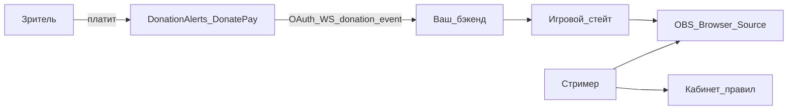
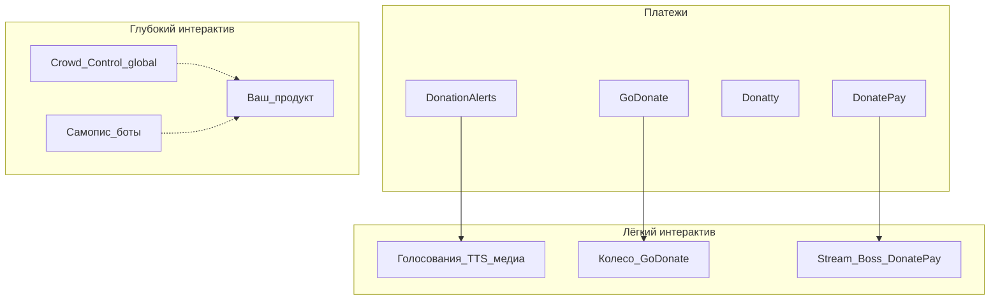

# Точный анализ: donation-игры для стримеров (РФ)

## 1. Целесообразность

**Вердикт: идея целесообразна как продукт категории «интерактив поверх донатов», нецелесообразна как ещё один DonationAlerts.**

| Критерий | Оценка | Почему |
| --- | --- | --- |
| Спрос | Высокий | Донаты в РФ растут (трафик на донат-сервисы ×3 в 2025, Yota); зритель уже платит «за момент» |
| Job-to-be-done | Сильный | Донат = власть / статус / «я организатор», а не только «спасибо» (Qiwi: 16% — организатор, 14% — выделиться) |
| Конкурентная пустота | Средняя–высокая | Глубоких «мини-игр чат vs стример» в RU почти нет; есть куски (Stream Boss, колесо) |
| Техническая реализуемость MVP | Высокая | DA даёт OAuth + real-time донаты (Centrifugo WS); OBS = browser source |
| Дистрибуция | Средняя | Стримеры инертны; нужен cold start через пилоты и клипы |
| Капиталоёмкость (без эквайринга) | Низкая–средняя | Web + realtime + 1–3 игры; без KYC/выплат |
| Капиталоёмкость (свой эквайринг) | Очень высокая | Нецелесообразно на старте |
| Риск копирования DA | Средний | DA может добавить виджет; защита — глубина геймплея и скорость |

**Условие go:** freemium SaaS / overlay **поверх** DA (и др.), короткие асимметричные сессии, uplift донатов как главная метрика пилота.

**Условие no-go:** свой приём платежей «как DA», или MVP = полноценные шахматы vs чат.

**Скор целесообразности (субъективно, при правильной рамке): 7.5/10.** Без корректировки позиционирования — ~4/10.

---

## 2. Аудитория

Два рынка платят по-разному: **B2B-ish стример** (подписка) и **B2C зритель** (донаты стримеру, не вам напрямую на старте).

### 2.1. Primary ICP — стример (покупатель SaaS)

| Сегмент | Avg viewers | Зачем вы | Приоритет |
| --- | --- | --- | --- |
| **A. Mid-tier variety / Just Chatting** | 50–2 000 | Готовый «блок эфира» на 20–40 мин, рост донатов без сценариста | **P0** |
| **B. IRL / реакции / «общение с чатом»** | 100–5 000 | Шоу и клипы важнее «честной игры» | **P0** |
| **C. Мелкие (рост)** | 10–50 | Нужен вау-эффект и повод вернуться чату | P1 (freemium) |
| **D. Топ / агентства** | 5 000+ | Кастом, ивенты, бренд-сейфти | P2 (после PMF) |
| **E. Хардкор esports (CS/Dota ranked)** | любой | Мало пауз под мини-игру | **Out of focus** |

Площадки РФ (порядок важности для продукта): **YouTube Live → VK Video / VK Play → Twitch → Kick / Trovo**. Донатный слой почти везде = DA у большинства.

Психографика стримера-ICP:

- уже принимает донаты через DA;
- устал от «только TTS и гифка»;
- готов 1 раз настроить OBS;
- меряет успех **рублями за эфир** и клипами, не DAU вашего сайта.

### 2.2. Secondary ICP — зритель (двигатель GMV)

| Тип | Доля поведения | Роль в вашей игре |
| --- | --- | --- |
| **Киты** | ~1–5% платящих, большая доля денег | Покупают OP-правила, «архитектор матча» |
| **Регулярные** | ~33% смотрящих стримы донатят регулярно (Qiwi, опрос) | Повторные мелкие/средние ходы, пулинг |
| **Случайные** | ~63% — «в особых случаях» | Вход через дешёвый эффект / голосование |
| **Молчаливые** | большая часть concurrent | Смотрят шоу; конверсия за эфир обычно **~1–5%** unique |

Дизайн должен обслуживать **толпу мелких**, иначе кит убивает атмосферу и чат отваливается.

### 2.3. Anti-persona

- Стример, которому нужен только дешёвый эквайринг.
- Каналы без живого чата (24/7 AFK, music bots).
- Аудитория, ждущая честный rated PvP / азартные ставки на деньги.

---

## 3. Интеграции

Архитектура: **вы не касаетесь денег зрителя**; слушаете события доната и крутите игру + overlay.



### 3.1. Must-have (MVP)

| Интеграция | Зачем | Как |
| --- | --- | --- |
| **DonationAlerts** | ~85% рынка РФ | OAuth 2.0 + Centrifugo WS (`$alerts:donation_{user_id}`); scopes на профиль и донаты |
| **OBS / Browser Source** | Универсальный вывод на любую площадку | URL сессии + токен стримера |
| **Кабинет стримера** | Цены эффектов, veto, cooldowns, пресеты | Web app |

### 3.2. Should-have (v1)

| Интеграция | Зачем |
| --- | --- |
| **DonatePay** | Вторая по значимости RU-платёжка + аудитория Stream Boss |
| **GoDonate / Donatty** | СБП и price-sensitive стримеры |
| **Чат-команды** (YouTube/Twitch) | Ход/голос без доната (engagement) + донат усиливает |

### 3.3. Later

- StreamElements / Streamlabs (для тех, кто на глобальном стеке + RU-платежи).
- TikTok gifts (если зайдёте в TikTok Live).
- Merchandise API DA (если когда-либо продаёте «внутриэкосистемные» товары) — не приоритет.
- Clip export / webhook в Discord стримера.

### 3.4. Чего не делать в интеграциях

- Свой эквайринг и «замените DA».
- Жёсткая привязка только к Twitch Extensions (режет RU YouTube/VK).
- Требовать десктоп-клиент на старте (web + OBS достаточно; десктоп — опционально как у Crowd Control).

---

## 4. Конкуренты

### 4.1. Карта



### 4.2. Сравнение

| Игрок | Категория | Сила | Слабость vs вы | Угроза |
| --- | --- | --- | --- | --- |
| **DonationAlerts** | Платежи + виджеты | Дистрибуция, доверие, 85% | Нет глубоких мини-игр чат-vs-стример | Может скопировать surface-виджеты |
| **DonatePay** | Платежи + Stream Boss | Уже «донат = бой» | Узкий набор механик | **Прямой** в нише boss-fight |
| **GoDonate** | Платежи + колесо | СБП, простота | Нет сессионных игр | Низкая–средняя |
| **Donatty** | Дешёвые платежи | Комиссия ~3.5% | Нет геймплея | Низкая |
| **Crowd Control** | Эффекты в чужих играх | 67k+ стримеров, Pro $8 / Max $20, заявленный ~1.8× income | Слабые RU-платежи; другая категория | Идея валидирована глобально |
| **SE / Streamlabs** | Tooling | Экосистема overlays | RU-донаты слабые | Средняя через партнёрства |
| **DIY стримеров** | Кастом | Доказывает спрос | Не масштабируется | Конкурирует за внимание, не за деньги |

### 4.3. Ваше отличие (должно быть жёстким)

Не «ещё алерты», а **сессионная мини-игра**, где:

1. чат играет **против / вместе** со стримером;
2. донат покупает **правило / ход / эффект** с видимым влиянием на матч;
3. есть **начало / середина / конец** эпизода (клипогенность);
4. баланс **кит vs пул мелких**.

Stream Boss = один жанр. Вы = **платформа жанров** (boss → cards → board → trivia), начиная с одного.

---

## 5. Коллаборации

Без коллабораций продукт не взлетает: стримеры не ищут «ещё один сайт», они копируют то, что увидели у коллеги.

| Тип партнёра | Зачем | Формат | Когда |
| --- | --- | --- | --- |
| **15–30 mid-tier стримеров** | PMF, VODs, сарафан | Бесплатный Pro на 3 мес + со-дизайн правил | День 0 |
| **DonationAlerts** | Дистрибуция | App в их экосистеме / кейс «виджеты сообщества» | После первых кейсов |
| **DonatePay** | Доступ к аудитории Boss | Совместный режим или «Boss 2.0» | Опционально |
| **Стримерские агентства / MCN** | Пакет на 10–50 каналов | White-label пресеты, отчёт по uplift | v1 |
| **Бренды (энергетики, VPN, геймдев)** | Спонсорские «правила матча» | Бренд-сейф пакет эффектов | После стабильного продукта |
| **Клип-мейкеры / TikTok-эдиторы** | Acquisition | Шаблон «лучший момент матча» | Параллельно пилоту |
| **Комьюнити (Discord-серверы стримеров, курсы «как стримить»)** | Образовательный вход | Гайд «донаты → шоу» | Постоянно |

**Принцип:** первый маркетинг = **контент чужих эфиров**, не ваш лендинг.

---

## 6. Возможный заработок

### 6.1. Модель (зафиксировать)

**Freemium SaaS для стримера**, без take-rate с чужих донатов на старте (проще юридически и в переговорах с DA).

Ориентир цен (локализация Crowd Control):

| Тариф | Цена | Что даёт |
| --- | --- | --- |
| Free | 0 ₽ | 1 игра, лимит эффектов/сессию, бренд watermark |
| Pro | **399–799 ₽/мес** (~$4–8) | Все базовые игры, кастом цен, без watermark |
| Max | **1 490–1 990 ₽/мес** (~$15–20) | Мультиплатформа-события, сезоны, приоритет, API |

Альтернатива позже: **1–2%** только с донатов, помеченных как «игровые» — только если DA/стримеры ок и юрмодель чистая.

### 6.2. Юнит-экономика стримера (зачем он платит)

Допущения для mid-tier:

- сейчас ~5–15 тыс. ₽ донатов / мес (сильно варьируется; DA-средний по старым данным ~6 276 ₽ — медиана ниже);
- пилот даёт **+20–50%** к донатам в часы с игрой (не ко всему месяцу);
- если 8 эфиров × 40 мин игры × uplift → даже **+2–5 тыс. ₽/мес** окупает Pro 799 ₽ многократно.

Crowd Control заявляет до **~1.8×** на интерактиве — используйте как **потолок маркетинга**, в пилоте целитесь в доказуемые **+15–30%** на сегмент.

### 6.3. Сценарии выручки сервиса (24 мес, РФ/СНГ)

Консервативные порядки (не forecast в банк):

| Сценарий | Платящие стримеры | ARPU | ARR |
| --- | --- | --- | --- |
| **Pessimistic** | 200 | 500 ₽ | **~1,2 млн ₽** |
| **Base** | 1 000 | 700 ₽ | **~8,4 млн ₽** |
| **Optimistic** | 3 000 | 900 ₽ | **~32 млн ₽** |
| **Stretch** (категория «дефолт») | 8 000 | 1 000 ₽ | **~96 млн ₽** |

Дополнительно: брендовые ивенты / white-label агентствам — разовые чеки **50–500 тыс. ₽**, могут удвоить выручку при сильном бренде формата.

**Вывод по деньгам:** это **осмысленный indie/bootstrap SaaS** или angel-stage продукт, не «единорог на эквайринге DA». Целесообразность высокая, если команда маленькая и фокус узкий.

### 6.4. Доля рынка (уточнённо)

- От **платёжного** рынка DA: стремиться к доле **не нужно** (~0% целевой).
- От **монетизирующих mid-tier** с интерактивом: за 24–36 мес реалистично **0,5–3%** как «основной игровой инструмент».
- Внутри узкой категории «stream mini-games / donation rulesets» в RU: цель — **лидер категории (30%+ mindshare)** при малом абсолютном числе игроков.

---

## 7. Точки роста

Приоритет по рычагу:

1. **Один killer-формат** → узнаваемость («пятничный босс-файт / rule roulette»).
2. **Баланс кит/толпа** → выше частота донатов, не только средний чек.
3. **Клипогенность из коробки** → Shorts/TikTok как бесплатный acquisition.
4. **Каталог игр 3→10** после PMF (не до).
5. **UGC-пакеты правил** (workshop) → сеть эффектов без вашей разработки каждой механики.
6. **Сезоны и рейтинги чатов** → привычка «вернуться в среду».
7. **Дуэли стример vs стример** → коллабы и кросс-аудитория.
8. **Бренд-пакеты** → второй поток выручки.
9. **СНГ + TR/KZ локали** → та же DA-экосистема.
10. **Шахматы/глубокие board-games** — только как **флагман v2**, когда сессионный UX и монетизация доказаны.

---

## 8. Риски

| Риск | Вероятность | Урон | Митигация |
| --- | --- | --- | --- |
| DA/DonatePay копируют surface-фичи | Средняя | Высокий | Глубина сессий, UGC, скорость, бренд формата |
| Нет uplift донатов в пилоте | Средняя | Экзистенциальный | Кастдев до кода; одна метрика пилота; быстрый kill |
| Кит ломает игру и чат | Высокая | Высокий | Пулинг, caps, cooldown, veto, «толпа копит ульт» |
| Юрриск «азарт / выигрыш денег» | Средняя | Высокий | Донат ≠ приз деньгами; только влияние/косметика/статус |
| Стримеры не настраивают OBS | Средняя | Средний | 5-минутный онбординг, пресеты, видео «подключи за 2 мин» |
| Зависимость от API DA | Средняя | Высокий | Абстракция провайдеров (DA/DP/GD); не хранить деньги |
| Trust/данные в RU fintech-слое | Низкая для overlay | — | Вы не процессите платежи — риск ниже, чем у DA |
| Выгорание на «ещё одна гифка» | Средняя | Средний | Чёткое отличие: матч с сюжетом, не алерт |
| Cold start | Высокая | Высокий | 15 пилотных стримеров до публичного запуска |
| Scope creep (сразу шахматы+карты+эквайринг) | Высокая | Высокий | Один жанр MVP |

---

## 9. Сшивка: что делать с идеей

**Позиционирование:**  
«Мы не принимаем донаты. Мы превращаем донаты в ходы, правила и эпизоды шоу — поверх DonationAlerts.»

**MVP-рамка:** см. продуктовую стратегию ниже (P0). Пилот: 10–15 стримеров; успех = uplift ₽/час игрового сегмента и повторные донаты в сессии.

---

## 10. Продуктовая стратегия

### 10.1. Продуктовое видение

**Категория:** Session Interactive Layer — сессионные мини-игры и тулзы, где донат = ход / правило / эффект.

**Не категория:** платёжный сервис, библиотека алертов, модпак для чужих AAA-игр.

**North Star метрика:** uplift донатов (₽) на час активного игрового сегмента vs обычный час того же стримера.

**Вторичные:** повторные донаты в одной сессии; % сессий, доведённых до конца; time-to-first-overlay < 5 мин; клипы с брендом формата.

**Принципы продукта:**

1. Донат всегда даёт **видимое влияние** на матч за <2 сек.
2. Сессия имеет **начало / кульминацию / конец** (клипогенность).
3. **Толпа важнее кита:** пулинг, caps, cooldowns обязательны в ядре.
4. Стример — режиссёр: **pause / veto / skip** всегда под рукой.
5. Платежи чужие; мы — **игровой стейт + overlay + правила**.
6. Одна платформа жанров, не зоопарк несвязанных виджетов.

### 10.2. Что должно быть в сервисе в принципе (системные слои)

Не список «фич ради фич», а постоянный каркас:

| Слой | Назначение | Примеры сущностей |
| --- | --- | --- |
| **Identity** | Аккаунт стримера | Логин, OAuth к донат-провайдерам, роли (streamer/mod) |
| **Donation ingest** | Нормализация платежей | `DonationEvent{amount, name, message, provider, ts}` |
| **Rules engine** | Донат → действие | Прайс-лист эффектов, пороги, пулинг, cooldown, очередь |
| **Session runtime** | Жизненный цикл матча | lobby → live → resolve → summary |
| **Game modules** | Плагable жанры | Boss, RuleRoulette, Duel, … один интерфейс |
| **Overlay / output** | То, что видит эфир | OBS browser source, scene presets, safe zones |
| **Streamer control** | Пульт режиссёра | Start/stop, veto, цены, лимиты, пресеты |
| **Viewer agency** | Как зритель понимает «что купить» | Панель эффектов / QR / ссылка «участвовать» |
| **Safety & fairness** | Антихаос | Caps на OP, rate limit, blacklist ников/слов, 18+ toggle |
| **Analytics** | Доказательство ценности | ₽/сессия, топ эффектов, сравнение до/после |
| **Billing (наш)** | SaaS подписка стримера | Free/Pro/Max, feature gates |
| **Content loop** | Рост | Recap сессии, shareable moment, шаблоны клипов |

Всё остальное (новые игры, сезоны, бренды) — надстройки над этим каркасом.

### 10.3. Что сознательно НЕ входит в продукт

| Вне скоупа | Почему |
| --- | --- |
| Свой эквайринг / вывод средств | Капитал, trust, конкуренция с DA |
| Замена алертов TTS/гифок DA | Они уже хорошо делают «оповещение» |
| Денежные призы зрителям / «ставки» с выигрышем ₽ | Юрриск азартных игр |
| Полноценный шахматный движок в MVP | Длина партии, сложность, fairness |
| Десктоп-клиент как must-have | Web + OBS достаточно |
| Соцсеть / лента для зрителей | Размазывает фокус |
| Античит AAA / инжект в чужие игры (Crowd Control-path) | Другая категория и стоимость |

### 10.4. Приоритет фичей по фазам

#### P0 — MVP / Pilot (6–10 недель): доказать uplift

**Одна игра на выбор (зафиксировать одну, не две):**

| Кандидат | Плюс | Минус | Рекомендация |
| --- | --- | --- | --- |
| **Rule Roulette** | Максимум «донат = правило», клипы, легко расширять | Слабее «прогресс босса» | **Предпочтительный MVP** |
| **Boss Fight** | Уже понятно рынку (DonatePay), простой метр HP | Легче скопировать, меньше уникальности | Сильный план B |
| Simple Duel (4-в-ряд / морской бой) | Ясный победитель | Нужен UX хода толпы | P1 |

**P0 фичи (все обязательны):**

| ID | Фича | Зачем |
| --- | --- | --- |
| F01 | Регистрация стримера + кабинет | База |
| F02 | OAuth DonationAlerts + realtime donation ingest | Без этого нет продукта |
| F03 | Маппинг сумма/сообщение → эффект из прайс-листа | Ядро монетизации зрителя |
| F04 | Пулинг мелких донатов в общий заряд | Анти-кит, вовлечение толпы |
| F05 | Cooldown / max level эффекта / очередь | Контроль хаоса |
| F06 | Пульт: start / pause / end / veto last effect | Режиссура эфира |
| F07 | OBS browser source overlay (игра + лента эффектов + таймер сессии) | Видимость на стриме |
| F08 | Страница зрителя «что можно купить» (ссылка/QR) | Снижает friction «не понял как участвовать» |
| F09 | Пресет цен по умолчанию + редактирование ₽ | Стример подстраивает под аудиторию |
| F10 | Recap после сессии (кто сильнее повлиял, топ эффектов, итог) | Клип + чувство прогресса |
| F11 | Онбординг <5 мин (чеклист: DA → overlay URL → тест-донат) | Снижает drop-off |
| F12 | Базовая аналитика сессии (сумма донатов в сегменте, число эффектов) | Доказательство ценности пилоту |

**Критерий выхода из P0:** ≥5 пилотных стримеров провели ≥3 сессии; медианный uplift сегмента ≥15% или качественный «не оторвать чат».

#### P1 — Product (после PMF): платформа, а не одна игрушка

| ID | Фича | Зачем |
| --- | --- | --- |
| F20 | 2–3-я игра (Boss и/или Simple Duel) | Retention стримера, разные дни недели |
| F21 | Абстракция `DonationProvider` + DonatePay | Не DA-only |
| F22 | GoDonate (СБП-аудитория) | Покрытие RU |
| F23 | Мод-роль / второй пульт | Стример не один у руля |
| F24 | Чат-команды как soft-participation (без ₽) + донат усиливает | Вовлечение молчаливых |
| F25 | Сохранённые пресеты «пятница / суббота» | Повторное использование |
| F26 | Watermark на Free / снятие на Pro | Монетизация SaaS |
| F27 | Сравнение «игровой час vs обычный» в кабинете | Upsell и доверие |
| F28 | Blacklist / фильтр сообщений на эффектах | Safety |
| F29 | Мобильный вид пульта (телефон стримера) | Удобство IRL |
| F30 | Шаринг recap-картинки (PNG для Stories/Shorts) | Acquisition |

#### P2 — Growth: сеть и дифференциация от копипаста DA

| ID | Фича | Зачем |
| --- | --- | --- |
| F40 | UGC / workshop пакетов правил | Контент без вашей разработки каждой механики |
| F41 | Сезоны / рейтинг чатов / стрики | Habit |
| F42 | Дуэль стример vs стример | Кросс-аудитория |
| F43 | Авто-highlight / export короткого клипа | Виральность |
| F44 | Бренд-пакеты эффектов (safe) | Второй revenue stream |
| F45 | White-label пресеты для агентств | B2B |
| F46 | Webhooks наружу (Discord стримера) | Встройка в их стек |
| F47 | Мультипровайдер в одной сессии (DA+DP сразу) | Реальность RU-стримеров |
| F48 | Глубокие board-games (шахматы/шашки с rule mods) | Флагман-маркетинг |
| F49 | Локали СНГ (KZ/BY) + мультиязык UI | Расширение SAM |

#### P3 — Later / opportunistically

- TikTok gifts как источник эффектов
- StreamElements/Streamlabs tipping bridges
- Merchandise / shop tie-in через DA
- Нативный мобильный стриминг-кит
- Take-rate с «игровых» донатов (только при юр. зелёном свете и партнёрстве)

### 10.5. Матрица приоритета (RICE-light)

Грубый порядок разработки внутри ближайших кварталов:

```text
P0: F02 → F03 → F07 → F06 → F04/F05 → F08 → F01/F09 → F10 → F11 → F12
     (ingest → rules → overlay → control → fairness → viewer UX → polish)

P1: F20 → F21 → F26/F27 → F22 → F24 → F23/F25 → F28–F30

P2: F40 → F41 → F42 → F43 → F44/F45 → F48 (шахматы не раньше устойчивого P1)
```

### 10.6. Что нужно поддерживать (операционка продукта)

| Область | SLA / практика | Почему |
| --- | --- | --- |
| **Realtime донатов** | Задержка эффект на экране <2 с p95 | Иначе «донат не сработал» = отвал доверия |
| **Стабильность overlay** | Не падать при 2–4 ч эфира; reconnect WS | Эфир нельзя ронять |
| **OAuth token refresh** DA/др. | Автообновление, алерт в кабинете если отвалилось | Частая боль интеграций |
| **Прайс и баланс эффектов** | Живой каталог: слишком OP → nerf без ломания сессий | Мета ломается китами |
| **Онбординг и доки** | Актуальные гайды OBS под Mac/Win | Саппорт иначе съест команду |
| **Статус провайдеров** | Страница «DA/DP OK» + fallback UX | Их даунтайм ≠ ваш молчаливый даунтайм |
| **Модерация abuse** | Репорты, бан эффектов с оскорблениями | Репутация стримера |
| **Биллинг подписки** | Продления, чеки, отмена в 2 клика | SaaS hygiene |
| **Обратная связь пилотов** | Changelog + голосование за следующую игру | Roadmap из рынка |
| **Юр. тексты** | Оферта, 18+, «не азарт» при новых механиках | Каждый новый «ставка»-like эффект |

### 10.7. Интеграции — стратегия

#### Принцип

`DonationProvider` interface → нормализованные события. UI и игры не знают про DA напрямую.

#### Дорожная карта интеграций

| Фаза | Интеграция | Тип | Обязательность |
| --- | --- | --- | --- |
| P0 | **DonationAlerts** OAuth + Centrifugo donations | Ingest | Must |
| P0 | **OBS** Browser Source | Output | Must |
| P0 | Ссылка/QR на viewer panel | Viewer | Must |
| P1 | **DonatePay** realtime/API | Ingest | Should |
| P1 | **GoDonate** | Ingest | Should |
| P1 | YouTube/Twitch chat bot (команды) | Engagement | Should |
| P1 | Платёжка SaaS (ЮKassa / CloudPayments и т.п.) **только за подписку стримера** | Billing us | Must for Pro |
| P2 | Donatty | Ingest | Could |
| P2 | Discord webhook (recap, старт сессии) | Notify | Could |
| P2 | TikTok Live gifts | Ingest | Could |
| P3 | StreamElements / Streamlabs | Ingest bridge | Later |
| — | Свой эквайринг донатов зрителей | — | **Never (стратегия)** |

#### Контракт минимального события (внутренний)

```text
DonationEvent:
  provider: da | donatepay | godonate | ...
  providerEventId: string
  amountRub: number
  username: string
  message: string | null
  timestamp: iso
  raw?: object
```

Rules engine: `amount + message + session.state → Effect | PoolContribution | Ignored`.

### 10.8. Тариф × фичи (монетизация продукта)

| Возможность | Free | Pro | Max |
| --- | --- | --- | --- |
| 1 базовая игра | ✓ | ✓ | ✓ |
| Каталог игр | — | ✓ | ✓ |
| Кастом цен / пресеты | ограничено | ✓ | ✓ |
| Watermark overlay | есть | нет | нет |
| Аналитика uplift | базовая | полная | полная + экспорт |
| Мультипровайдер | 1 | 2 | все |
| Сезоны / дуэли / UGC | — | частично | ✓ |
| Бренд-пакеты / приоритет саппорта | — | — | ✓ |

Цены-ориентир: Free / **399–799** / **1 490–1 990** ₽ в мес.

### 10.9. Рекомендуемый killer-format на старт

**Rule Roulette (чат меняет правила шоу):** стример играет в простую активность или «выживает N минут»; зрители за донат включают правила из магазина (зеркальный экран, запрет слова, таймер-ускорение, «чат выбирает следующее действие», дебафф стримера и т.д.). Пул мелких донатов открывает **Community Ult**.

Почему это стратегия, а не Boss:

- сильнее дифференцирует от DonatePay Stream Boss;
- напрямую бьёт в JTBD «я организатор стрима»;
- правила = бесконечный UGC-roadmap;
- короткие раунды 8–15 мин под темп эфира.

Boss Fight — вторая игра в P1 для тех, кто уже привык к жанру.

### 10.10. Definition of Done по стратегии (12 месяцев)

- Каркас из §10.2 стабилен; ≥3 game modules.
- DA + минимум ещё 1 RU-провайдер.
- ≥500 MAU стримеров или ≥200 платящих — иначе пересмотр позиционирования.
- North Star считается автоматически в кабинете.
- Нет собственного эквайринга донатов; нет денежных призов зрителям.
- Шахматы — только если P1 удержан и есть спрос из кастдева/голосования.

---

## 11. Next steps

1. Кастдев: 10 mid-tier — подтвердить Rule Roulette vs Boss как P0.
2. Зафиксировать прайс Free/Pro и feature gates (§10.8).
3. Техспайк: DA OAuth + Centrifugo → Effect на overlay <2 с.
4. Спроектировать `DonationProvider` + `RulesEngine` + `Session` до первой игры.
5. Юрчеклист: оферта, 18+, отсутствие денежных призов.
6. Outreach: 15 пилотов под P0.
